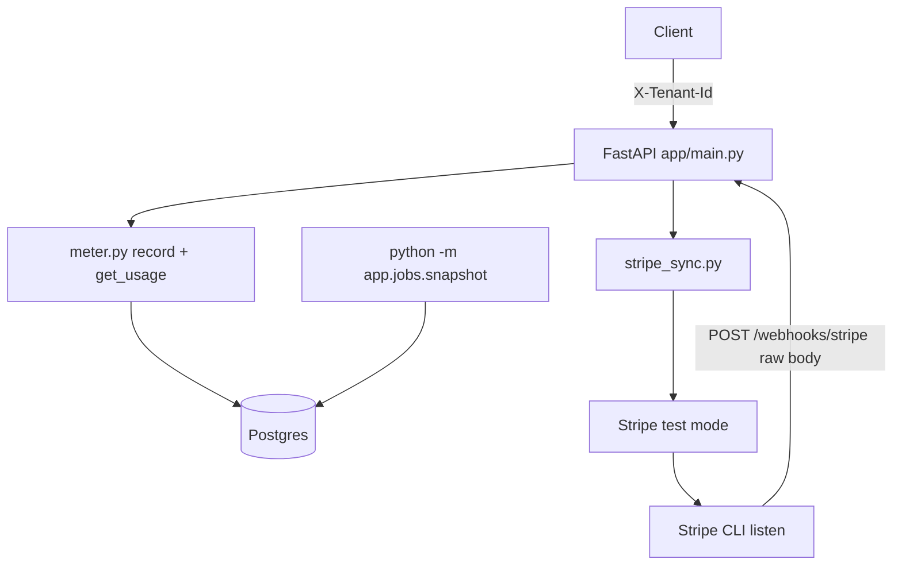

# metering-billing-engine

Usage metering and test-mode Stripe billing for a dummy `POST /generate`. Python, FastAPI, Postgres in Docker.

A tenant is on Free or Pro. Each billable request records **exactly one** `usage_events` row per `(tenant_id, idempotency_key)`. Quota is a UTC calendar month. `GET /usage` **always** live-sums events. Stripe Checkout and webhooks change plan/status only after a verified signature. A separate process photocopies monthly totals into `usage_monthly_snapshots` and prints `DRIFT` if that copy disagrees with a second live sum.

## Architecture



HTTP stays thin: status codes and headers. Services own quota, cost, and Stripe apply. The job is **not** started by Uvicorn. In production you would cron `python -m app.jobs.snapshot`. Locally you run it yourself.

## Non-goals

No live Stripe, no public tunnel, no real model, no invoicing, no proration, no overage invoices. Tokens are numbers in JSON. `X-Tenant-Id` is demo identity, not auth. Isolation is still `tenant_id` on every query.

## Plans

| Plan | API calls / UTC month | AI tokens / UTC month |
|------|------------------------|------------------------|
| Free | 1,000                  | 100,000                |
| Pro  | 10,000                 | 1,000,000              |

Pro is 10x Free. 429 = active plan, meter full (`Retry-After` = seconds until next UTC month). 402 = subscription not `active`.

## Money

Integer **micro-USD** (1_000_000 = $1.00). Defaults in `app/config.py`:

- API call: 100
- Input: 150_000 per million tokens
- Cached input: 37_500 per million
- Output and reasoning: 600_000 per million

Cost for a token event: `(input * in + cached * cached + (output + reasoning) * out) // 1_000_000`.

## Run

Host Postgres is **5435** (container 5432). Copy `.env.example` to `.env` and keep that port.

```
python -m venv .venv
```

Activate `.venv`, then:

```
pip install -r requirements.txt
docker compose up -d
alembic upgrade head
python -m app.seed
uvicorn app.main:app --reload
```

- Liveness: `GET http://127.0.0.1:8000/health`
- DB: `GET http://127.0.0.1:8000/ready`

Seed prints two tenant UUIDs. Header is always `X-Tenant-Id` (not a different header per tenant).

| Tenant | UUID |
|--------|------|
| A (demo, may be Pro after Checkout) | `11111111-1111-1111-1111-111111111111` |
| B (isolation, Free) | `44444444-4444-4444-4444-444444444444` |

Billable generate:

```
curl -s -X POST http://127.0.0.1:8000/generate -H "X-Tenant-Id: 11111111-1111-1111-1111-111111111111" -H "Idempotency-Key: some-unique-key" -H "Content-Type: application/json" -d "{\"meter\":\"api_call\"}"
```

Tokens: `"meter":"ai_tokens"` plus at least one of `input_tokens`, `cached_input_tokens`, `output_tokens`, `reasoning_tokens` (integers >= 0).

Usage:

```
curl -s http://127.0.0.1:8000/usage -H "X-Tenant-Id: 11111111-1111-1111-1111-111111111111"
```

Fill Free API cap (loops until 429): `python scripts/fill_free.py`

Snapshot job:

```
python -m app.jobs.snapshot
```

## Stripe (test mode only)

1. Sandbox Dashboard: Product + **recurring Price**. Put `price_...` in `STRIPE_PRICE_PRO`. Put `sk_test_...` in `STRIPE_SECRET_KEY`. Never `sk_live_`.
2. `stripe listen --forward-to localhost:8000/webhooks/stripe`
3. Put the printed `whsec_...` in `STRIPE_WEBHOOK_SECRET`. Restart Uvicorn after editing `.env`.
4. `POST /checkout` with `X-Tenant-Id` of tenant A. Open `url`. Pay with `4242 4242 4242 4242`.
5. Plan flips on the **webhook**, not on `/health?checkout=success`.

Do not commit `.env`.

## Locks

- Same generate twice: `UNIQUE (tenant_id, idempotency_key)`. Conflict returns the first row.
- Two different keys racing the last quota unit: `SELECT ... FOR UPDATE` on the subscription row.
- Stripe replay: `processed_stripe_events.event_id` primary key.

## Evidence

`EVIDENCE.md` has replayable transcripts for Section 6 (metering, quota, cost, Checkout, webhooks, isolation, snapshot). `BUILDLOG.md` is the honesty log.

## Limitations

`X-Tenant-Id` is not login. Snapshot rows are a photocopy; they can lag `/usage` until you run the job. Stripe CLI must be running for local webhooks. Pricing constants are pinned plausible integers, not a vendor price list.
